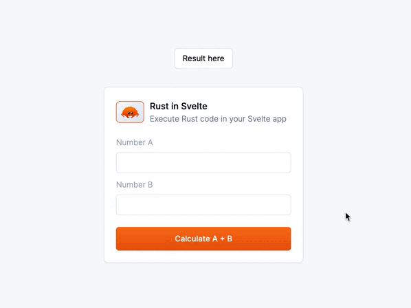

# Demo Svelte + Rust

👉 You can play around the live demo [here](https://svelte-rust.vercel.app/)



# Create a Svelte app

Everything you need to build a Svelte project, powered by [`create-svelte`](https://github.com/sveltejs/kit/tree/master/packages/create-svelte).

## Creating a project

If you're seeing this, you've probably already done this step. Congrats!

```bash
# create a new project in the current directory
npm create svelte@latest

# create a new project in my-app
npm create svelte@latest my-app
```

## Developing

Once you've created a project and installed dependencies with `npm install` (or `pnpm install` or `yarn`), start a development server:

```bash
npm run dev

# or start the server and open the app in a new browser tab
npm run dev -- --open
```

## Building

To create a production version of your app:

```bash
npm run build
```

You can preview the production build with `npm run preview`.

> To deploy your app, you may need to install an [adapter](https://kit.svelte.dev/docs/adapters) for your target environment.

# Add some Rust 🦀 to your Svete app

Install Rust by going to the [Install Rust](https://www.rust-lang.org/tools/install) page and following the instructions.

## Install wasm-pack

```bash
cargo install wasm-pack
```

## Create a new Rust package

```bash
cargo new --lib my-package
```

## Write a Rust function

```rust
// my-package/src/lib.rs

use wasm_bindgen::prelude::*;

#[wasm_bindgen]
pub fn add(a: i32, b: i32) -> i32 {
    a + b
}
```

## Specify the version of the package

By adding crate-type = ["cdylib"]

```toml
[package]
name = "my-package"
version = "0.1.0"
edition = "2021"

# See more keys and their definitions at https://doc.rust-lang.org/cargo/reference/manifest.html

[dependencies]
wasm-bindgen = "0.2.87"

[lib]
crate-type = ["cdylib"]
```

## Build your Rust package

```bash
cd my-package
wasm-pack build --target web
```

## Pick the generated pkg folder generated in my-package

And drop it in the /lib folder of your Svelte app

## Import your Rust package in your Svelte app

```javascript
// src/routes/+page.svelte

import init, { add } from "$lib/pkg/my_package";

onMount(async () => {
	await init();
});

function handleClick(): void {
	result = add(numberA, numberB);
}
```
